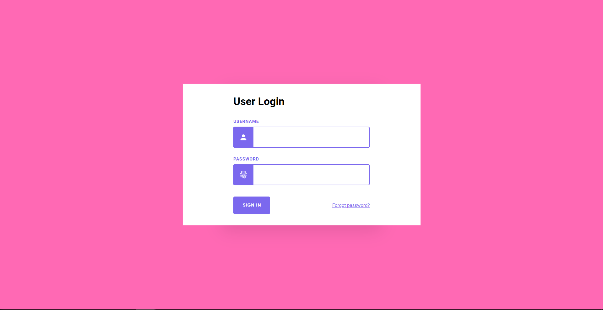
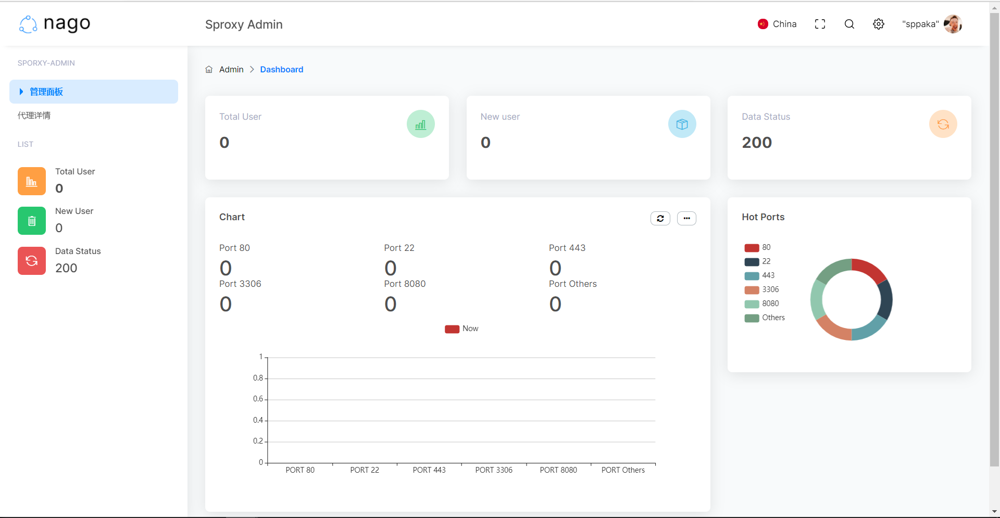
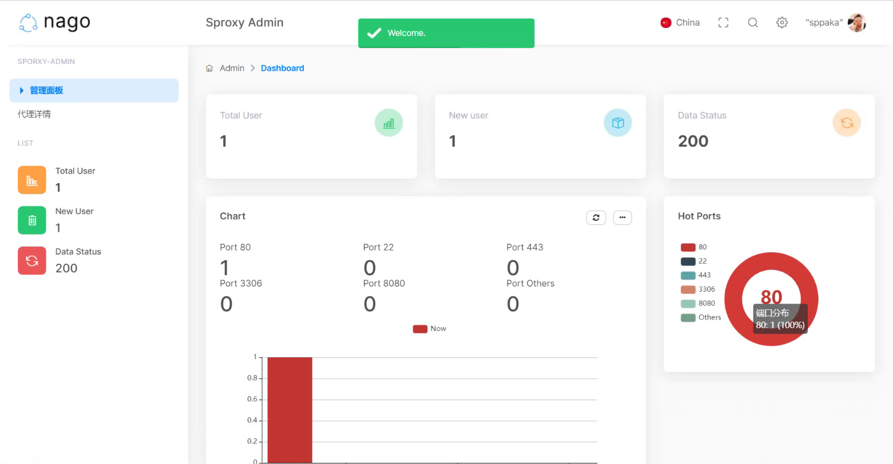
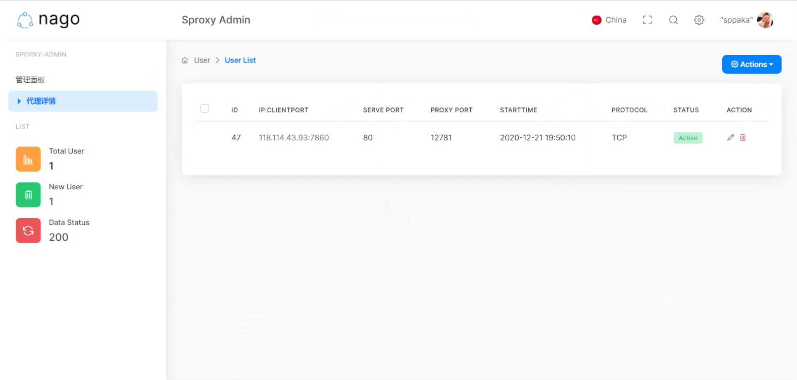

# Sproxy_Admin

###### Go+Gin WEB Background Monitoring

### 后台面板介绍

##### Web管理器模块：为了保证项目的兼容性和可拓展性，我们选择使用Go语言Gin框架提供Web后端服务，HTML+CSS+JavaScript组合作为前端开发框架。Go语言作为后端可以与代理服务器互相调用，以后的拓展以及二次开发更加方便。

##### 项目主体使用Gin框架，使用CORS拓展解决跨域问题。主要思想是以Go语言Gin框架作为后端提供WEB服务，接收前端GET以及POST请求，连接Mysql将实时统计数据传递给前端展示。同时服务器可以使用插入删除数据的InsertLogs与DeleLogs函数在客户端连接以及退出时进行数据统计。

##### 登录功能使用Session+Cookie维护持续性，使用模组："github.com/gin-contrib/sessions"和"github.com/gin-contrib/sessions/cookie"来实现Session的缓存机制，将Session应用进Gin。使用模组"database/sql"和_ "github.com/go-sql-driver/mysql"连接Mysql数据库并开启进程池。

### 项目截图

